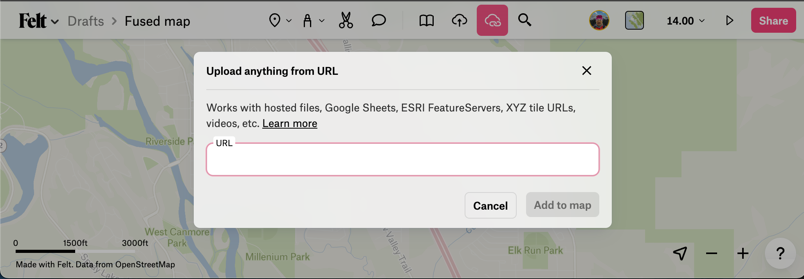
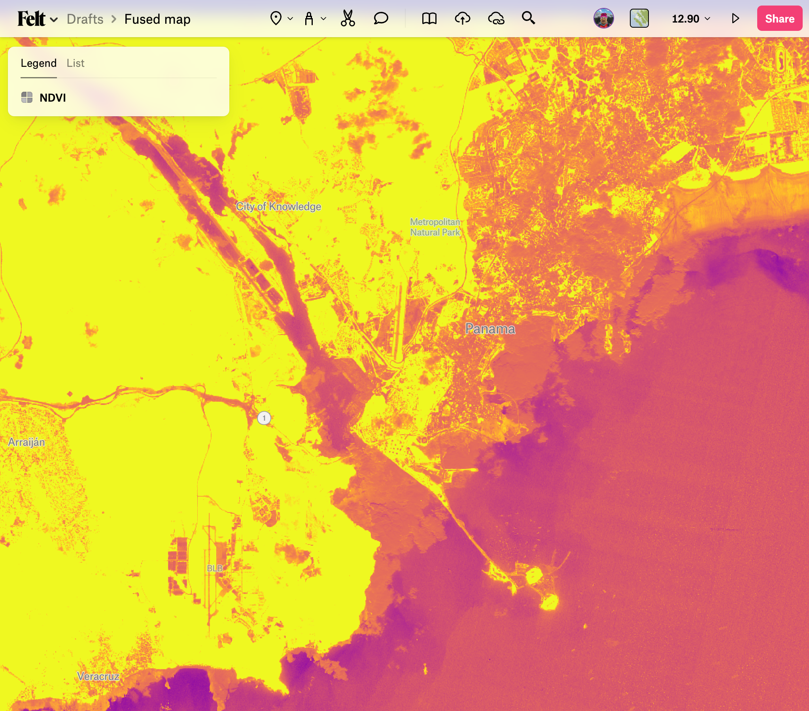
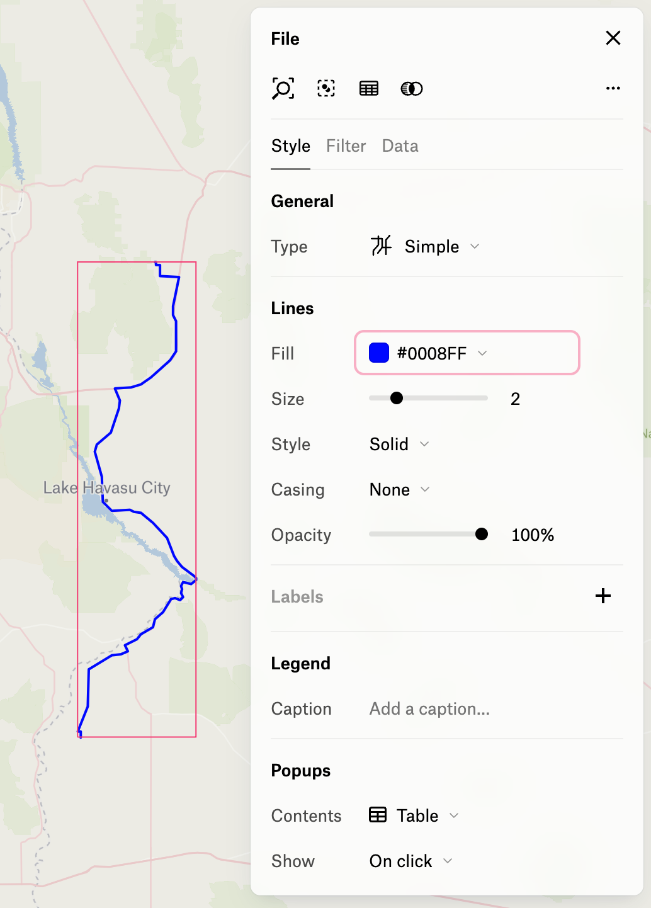

# Felt


[Felt](https://felt.com/) is an interactive and collaborative map making platform. Teams use it to quickly create stunning map visualizations - without needing to move data around nor install software. 

Felt supports a number of [file formats](https://www.youtube.com/watch?v=zgadqdMMYp0&ab_channel=Felt), some of which can originate from hosted URLs. Fused UDFs can be configured to return data in some of those formats - all it takes is a simple URL call.


To follow along, you'll need a Felt account - which you can create for free.

To load data from Fused, you'll first generate a signed UDF URL.

## 1. Generate a signed URL for a UDF

First, on Workbench, create and save a UDF that successfully renders in `File` mode. Under the "Settings" tab, click "Share" to [generate a signed URL](/basics/core-concepts/#generate-endpoints-with-workbench) that can be called via HTTP requests. 

Modify the generated `HTTP` URL depending on the data type, as detailed below. You can optionally pass UDF parameters as URL-encoded strings, which can be configured to change based on query input.

## 2. Load data into Felt

There's 2 ways to load data from Fused into Felt, depending on whether the UDF returns a raster or vector data type. Both are passed through the "Upload from URL" modal, but require particular URL structures. Read the [Felt docs](https://feltmaps.notion.site/Upload-Anything-b26d739e80184127872faa923b55d232#3e37f06bc38c4971b435fbff2f4da6cb) for a deeper dive into this feature.



### Raster Tiles

Dynamically render XYZ raster tiles on the Felt map.

As an example, the ["Sentinel Tile Example"](https://github.com/fusedio/udfs/tree/main/public/Sentinel_Tile_Example) public UDF returns an XYZ tile URL of NDVI from the Sentinel dataset. Create a new instance of it on your workbench, generate a shared URL, then modify the URL query parameters:

- Set `dtype_out_raster` to `png`.
- Set replace the values after `/run/tiles` with the `/{z}/{x}/{y}` template.
- Set UDF parameters as needed.

For example:


```bash
https://www.fused.io/server/v1/realtime-shared/da71c7bf79376f2e88b37be9ecd2679f2e40a5b79f9b0f2c75e7ea9a3f0c5171/run/tiles/{z}/{x}/{y}?dtype_out_raster=png
```

This should render the raster output tiles on the map. This example shows NDVI on the area surrounding the Panama Canal.



### Vector

Load vector data in a one-off manner onto the Felt map.

As an example, the ["Single Route"](https://github.com/fusedio/udfs/tree/main/public/single_route) public UDF returns a composite vector line of driving directions between an origin and destination locations. Create a new instance of it on your workbench, generate a shared URL, then modify the URL query parameters:

- Set `dtype_out_vector` to `csv` or `parquet`.
- Set UDF parameters as needed.

For example:
```bash
https://www.fused.io/server/v1/realtime-shared/4f8fe6b81811ce011d7045b9fffbcfb43663637a4c626955821566fe62e6fb57/run/file?dtype_out_vector=csv&lat_start=35.0154145&lng_start=-114.2253804&lat_end=33.9422&lng_end=-114.4036
```


Click "Upload from URL", paste the URL, and click "Add to map".


This should load the data and render it on the map.



Note that once the data is loaded, it's cached in the Felt platform so it won't be affected by modifications to the UDF.


